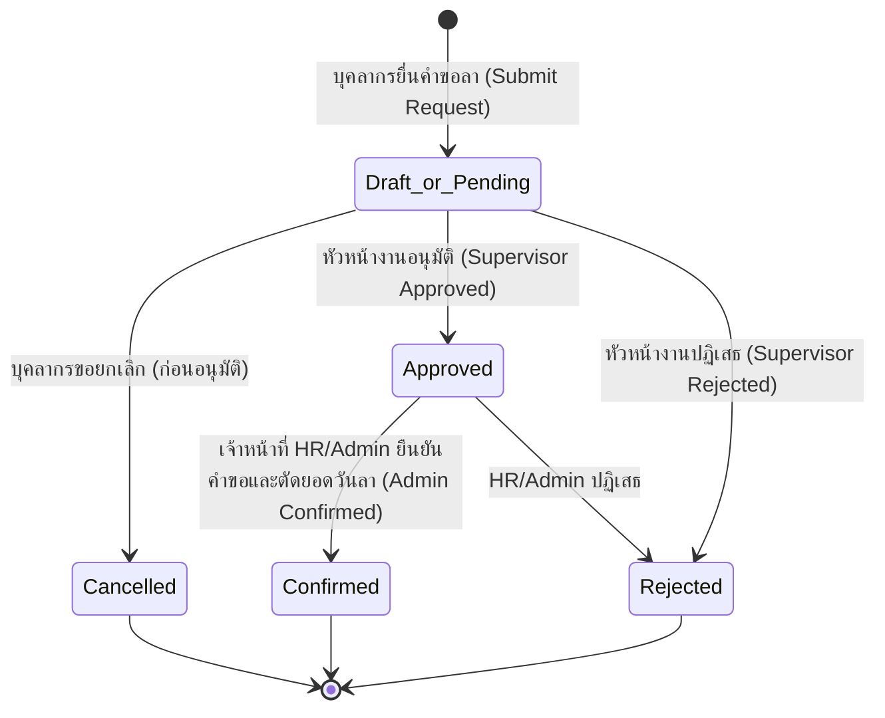

# ระบบบริหารการลา มหาวิทยาลัยราชภัฏบุรีรัมย์
## Buriram Rajabhat University Leave Management System (BRU LMS)

---

## 1. ข้อมูลภาพรวมผลิตภัณฑ์ (Product Overview)

ระบบบริหารการลา มหาวิทยาลัยราชภัฏบุรีรัมย์ (BRU Leave Management System) เป็นเว็บแอปพลิเคชันระดับองค์กรที่พัฒนาขึ้นเพื่อยกระดับและเปลี่ยนผ่านกระบวนการบริหารจัดการการลาของบุคลากรภายในมหาวิทยาลัยจากระบบเอกสารกระดาษสู่ระบบดิจิทัลแบบครบวงจร (End-to-End Digital Transformation) สอดคล้องตามระเบียบสำนักนายกรัฐมนตรีว่าด้วยการลาของข้าราชการ พ.ศ. 2555 และข้อบังคับมหาวิทยาลัยราชภัฏบุรีรัมย์

ระบบครอบคลุมตั้งแต่การยื่นใบลาออนไลน์ การแนบเอกสารหลักฐาน การลงลายมือชื่อดิจิทัล (Digital Signature) เวิร์กโฟลว์การพิจารณาอนุมัติตามสายการบังคับบัญชา การตรวจสอบสิทธิและยอดวันลาคงเหลือ การเชื่อมโยงปฏิทินวันลาของทีม ไปจนถึงการออกรายงานสถิติ การส่งออกไฟล์ Excel/PDF สำหรับงานบริหารงานบุคคล และการประมวลผลยอดวันลาประจำปีงบประมาณอัตโนมัติ

---

## 2. กลุ่มผู้ใช้งานและบทบาท (User Roles & Personas)

ระบบแบ่งบทบาทผู้ใช้งานออกเป็น 3 ระดับหลัก ตามสิทธิและความรับผิดชอบในองค์กร:

### 2.1 บุคลากรทั่วไป (Personnel / Employee) — Role: `employee`
- **เป้าหมาย:** ยื่นคำขอลาได้อย่างสะดวกรวดเร็ว ตรวจสอบสิทธิและประวัติการลาของตนเองได้แบบเรียลไทม์
- **ฟังก์ชันหลัก:**
  - ยื่นคำขอลาออนไลน์ (เลือกประเภทการลา, ช่วงเวลาเต็มวัน/ครึ่งวันเช้า/บ่าย, ระบุเหตุผล, สถานที่ติดต่อ, แนบเอกสาร)
  - พรีวิวและสร้างแบบฟอร์มใบลามาตรฐานราชการในรูปแบบไฟล์ PDF พร้อมลายเซ็นดิจิทัล
  - ตรวจสอบยอดวันลาคงเหลือ (Leave Balance) และประวัติการลา (Leave History)
  - ยกเลิกคำขอลาที่อยู่ระหว่างรอการพิจารณา
  - ดูปฏิทินวันลาส่วนตัว และปฏิทินวันลาของเพื่อนร่วมทีม/สาขาวิชา (Team Calendar)
  - ดาวน์โหลดแบบฟอร์มใบลาทางการ และศึกษาระเบียบข้อบังคับการลา
  - จัดการข้อมูลส่วนตัว อัปโหลดรูปโปรไฟล์ และอัปโหลด/วาดลายเซ็นดิจิทัล

### 2.2 หัวหน้างาน / ผู้บังคับบัญชา (Supervisor / Department Head) — Role: `head` หรือ `supervisor`
- **เป้าหมาย:** พิจารณา กลั่นกรอง และอนุมัติคำขอลาของผู้ใต้บังคับบัญชาได้อย่างมีประสิทธิภาพ
- **ฟังก์ชันหลัก:**
  - เข้าถึงหน้า "อนุมัติใบลา" (`/approvals`) เพื่อดูรายการคำขอลาที่รอการพิจารณาของผู้ใต้บังคับบัญชาในสังกัด
  - ตรวจสอบรายละเอียดคำขอลา ประวัติการลา และยอดคงเหลือของผู้ยื่นคำขอ
  - ดำเนินการ "อนุมัติ (Approve)" หรือ "ไม่อนุมัติ (Reject)" พร้อมบันทึกความเห็น/เหตุผล และประทับลายมือชื่อดิจิทัล
  - ดูปฏิทินวันลาของทีมเพื่อวางแผนกำลังคนและป้องกันการลาซ้อนทับกัน

### 2.3 ผู้ดูแลระบบ / เจ้าหน้าที่ HR (Administrator / HR Officer) — Role: `admin`
- **เป้าหมาย:** บริหารจัดการระบบ กำหนดค่าองค์กร กำกับดูแลคำขอลาทั้งหมด ออกรายงาน และดูแลความถูกต้องของข้อมูล
- **ฟังก์ชันหลัก:**
  - จัดการใบลาทั้งหมดในระบบ (`/admin/leaves`) ตรวจสอบและดำเนินการยืนยันคำขอลา (Confirm)
  - จัดการข้อมูลบุคลากร (`/users`) เพิ่ม/แก้ไข/ลบ กำหนดสังกัดคณะ สาขาวิชา และหัวหน้างาน
  - นำเข้าข้อมูลบุคลากรแบบกลุ่ม (Batch Import) ผ่านไฟล์ CSV / Excel พร้อมระบบตรวจสอบและพรีวิวข้อมูล
  - เชื่อมโยงและซิงค์ข้อมูลกับฐานข้อมูลมหาวิทยาลัย หรือ University API
  - จัดการโครงสร้างองค์กร (คณะ/สำนัก/สถาบัน และ สาขาวิชา/ฝ่ายงาน)
  - จัดการประเภทการลา สิทธิวันลาพื้นฐาน และเงื่อนไขการสะสมวันลา (`/leave-types`)
  - จัดการปฏิทินวันหยุดนักขัตฤกษ์และวันหยุดราชการประจำปี (`/holidays`)
  - ดูสถิติการลา ออกรายงานสรุป และส่งออกข้อมูลเป็น Excel หรือ PDF (`/reports`)
  - ดำเนินการตัดยอดและยกยอดวันลาพักผ่อนประจำปีงบประมาณ (Fiscal Year Rollover)

---

## 3. สิทธิ์การเข้าถึงเมนูและระบบ (Access Control Matrix)

| เมนู / ฟังก์ชัน | เส้นทาง (Route) | บุคลากร (`employee`) | หัวหน้างาน (`head`) | ผู้ดูแลระบบ (`admin`) |
|---|---|:---:|:---:|:---:|
| หน้าหลัก (Dashboard) | `/dashboard` | ✅ | ✅ | ✅ |
| ยื่นใบลา (Leave Request) | `/leave-request` | ✅ | ✅ | ❌ *(จัดการผ่านระบบแทน)* |
| ประวัติการลา (Leave History) | `/leave-history` | ✅ | ✅ | ❌ *(ดูผ่านจัดการใบลา)* |
| ปฏิทินการลาส่วนตัว (Calendar) | `/calendar` | ✅ | ✅ | ✅ |
| วันลาทีม (Team Calendar) | `/team-calendar` | ✅ | ✅ | ❌ |
| ดาวน์โหลดแบบฟอร์ม (Leave Forms) | `/forms` | ✅ | ✅ | ✅ |
| ระเบียบการลา (Leave Regulations) | `/regulations` | ✅ | ✅ | ✅ |
| ข้อมูลส่วนตัวและลายเซ็น (Profile) | `/profile` | ✅ | ✅ | ✅ |
| อนุมัติใบลา (Approvals) | `/approvals` | ❌ | ✅ | ✅ |
| จัดการใบลาทั้งหมด (Admin Leaves) | `/admin/leaves` | ❌ | ❌ | ✅ |
| จัดการบุคลากร (User Management) | `/users` | ❌ | ❌ | ✅ |
| รายงานการลา (Reports & Analytics) | `/reports` | ❌ | ❌ | ✅ |
| จัดการประเภทการลา (Leave Types) | `/leave-types` | ❌ | ❌ | ✅ |
| จัดการวันหยุด (Holiday Management) | `/holidays` | ❌ | ❌ | ✅ |

---

## 4. ประเภทการลาและกฎเกณฑ์ทางธุรกิจ (Leave Types & Business Logic)

ระบบรองรับประเภทการลามาตรฐานราชการไทย 8 ประเภท:

1. **ลาป่วย (Sick Leave - `sick`):** สำหรับการเจ็บป่วยหรือรักษาพยาบาล หากลาติดต่อกันตั้งแต่ 3 วันทำการขึ้นไป ระบบจะแจ้งเตือนให้แนบใบรับรองแพทย์
2. **ลากิจส่วนตัว (Personal Leave - `personal`):** สำหรับการทำธุระส่วนตัวที่จำเป็น ระบุเหตุผลและสถานที่ติดต่อ
3. **ลาพักผ่อน (Vacation Leave - `vacation`):** สำหรับการพักผ่อนประจำปี มีการคำนวณวันสะสมตามอายุราชการ และสามารถยกยอดสะสมข้ามปีงบประมาณได้ตามระเบียบ
4. **ลาคลอดบุตร (Maternity Leave - `maternity`):** สิทธิการลาเพื่อคลอดบุตรสำหรับบุคลากรหญิง (สูงสุด 90 วัน)
5. **ลาช่วยภรรยาคลอด (Paternity Leave - `paternity`):** สิทธิสำหรับบุคลากรชายเพื่อช่วยดูแลภรรยาและบุตรแรกเกิด (สูงสุด 15 วันทำการ)
6. **ลาเลี้ยงดูบุตร (Childcare Leave - `childcare`):** การลาต่อเนื่องเพื่อดูแลบุตร
7. **ลาอุปสมบทหรือประกอบพิธีฮัจย์ (Ordination/Hajj Leave - `ordination`):** สำหรับบุคลากรที่ประสงค์จะอุปสมบทหรือเดินทางไปประกอบพิธีฮัจย์
8. **ลาตรวจเลือกหรือเตรียมพล (Military Leave - `military`):** สำหรับการเข้ารับการตรวจเลือกหรือระดมพลตามกฎหมายว่าด้วยการรับราชการทหาร

### กฎเกณฑ์การคำนวณวันลา (Calculation Rules)
- **รองรับหน่วยวันลาแบบครึ่งวัน:** รองรับการลาเต็มวัน (1.0 วัน), ครึ่งวันเช้า (0.5 วัน), และครึ่งวันบ่าย (0.5 วัน)
- **การนับวันทำการ (Working Days):** ระบบจะไม่นับวันเสาร์-อาทิตย์ และวันหยุดนักขัตฤกษ์ที่ระบุในตาราง `holidays` (สำหรับประเภทการลาที่นับเฉพาะวันทำการ)
- **รอบปีงบประมาณ (Fiscal Year):** ยึดรอบปีงบประมาณราชการไทย (1 ตุลาคม – 30 กันยายนของปีถัดไป)
- **การยกยอดวันลาพักผ่อน (Vacation Balance Carryover):** มีระบบ Cron Job ทำงานอัตโนมัติทุกวันที่ 1 ตุลาคม เพื่อตัดรอบยอดวันลาประจำปี และคำนวณวันลาพักผ่อนสะสมตามเกณฑ์อายุราชการ

---

## 5. เวิร์กโฟลว์การขออนุมัติการลา (Approval Workflow)



1. **ขั้นตอนที่ 1 (Submission):** บุคลากรกรอกแบบฟอร์ม เลือกประเภทการลา วันที่ ช่วงเวลา ระบุเหตุผล พร้อมแนบไฟล์และเลือกลายเซ็นดิจิทัล ระบบจะบันทึกสถานะเป็น `pending` และแจ้งเตือนไปยังหัวหน้างาน
2. **ขั้นตอนที่ 2 (Supervisor Review):** หัวหน้างานตรวจสอบรายละเอียด ตรวจสอบวันลาคงเหลือ และเลือกว่าจะ "อนุมัติ" พร้อมประทับลายเซ็นดิจิทัล (สถานะเปลี่ยนเป็น `approved`) หรือ "ไม่อนุมัติ" พร้อมระบุเหตุผล (สถานะเปลี่ยนเป็น `rejected`)
3. **ขั้นตอนที่ 3 (Admin Confirmation):** ผู้ดูแลระบบหรือเจ้าหน้าที่ HR ตรวจสอบความถูกต้องและดำเนินการ "ยืนยันการลา (Confirmed)" ซึ่งจะทำการหักลดยอดวันลาใน `leave_balances` อย่างเป็นทางการ
4. **บันทึกประวัติ (Audit Trail):** ทุกการเปลี่ยนแปลงสถานะจะถูกบันทึกประวัติการกระทำ เวลา และผู้ดำเนินการลงในตาราง `leave_histories`

---

## 6. โมดูลระบบที่สำคัญ (Key Functional Modules)

### 6.1 ระบบการจัดการผู้ใช้และองค์กร (User & Organization Management)
- โครงสร้างองค์กร 2 ระดับ: คณะ/สำนัก/สถาบัน (Faculties) $\rightarrow$ สาขาวิชา/กอง/ฝ่าย (Departments)
- ความสัมพันธ์แบบลำดับขั้น: ผู้ใต้บังคับบัญชาเชื่อมโยงกับหัวหน้างาน (Supervisor Assignment)
- การนำเข้าผู้ใช้แบบกลุ่ม (CSV / Excel Import) พร้อมระบบตรวจสอบความถูกต้องของฟิลด์และตัวอย่างก่อนนำเข้าจริง (Preview & Validation)
- ระบบซิงค์ข้อมูลกับฐานข้อมูลภายนอกและ University API

### 6.2 ระบบสร้างและดาวน์โหลดเอกสารราชการ (Document & PDF Generation)
- สร้างไฟล์แบบฟอร์มใบลาตามระเบียบราชการไทยแบบ Dynamic PDF บนฝั่ง Client และ Server
- ฝังลายเซ็นดิจิทัล (Digital Signature) ของผู้ขอลาและหัวหน้างานลงในเอกสารโดยอัตโนมัติ
- รองรับการดาวน์โหลดแบบฟอร์มเอกสารใบลาฉบับเปล่าทางการในรูปแบบ PDF ผ่าน `/forms`

### 6.3 ระบบแจ้งเตือน (In-App Notification Center)
- แจ้งเตือนแบบ In-App Notification (ไอคอนกระดิ่งพร้อม Badge แสดงจำนวนที่ยังไม่ได้อ่าน)
- แจ้งเตือนหัวหน้างานเมื่อมีคำขอลาใหม่
- แจ้งเตือนผู้ยื่นคำขอเมื่อคำขอลาได้รับการอนุมัติ ปฏิเสธ หรือยืนยัน
- Responsive Notification Drawer รองรับทั้ง Desktop (ป๊อปอัปขึ้นจากแถบด้านล่างของ Sidebar) และ Mobile (เมนูแบบเต็มความกว้าง)

### 6.4 ระบบรายงานและการวิเคราะห์ (Reporting & Data Analytics)
- แดชบอร์ดสรุปสถิติภาพรวมการลาในรูปแบบการ์ดสถิติ
- รายงานการลาแบบละเอียด กรองตามปีงบประมาณ คณะ สาขาวิชา ประเภทการลา และสถานะ
- ส่งออกข้อมูลเป็นไฟล์ Excel (.xlsx) และ PDF (.pdf) ที่จัดรูปแบบตารางอย่างสวยงาม

---

## 7. สถาปัตยกรรมทางเทคนิค (Technical Architecture)

```
[ Frontend: React 19 + Vite ]
   │
   ├─ React Router v7 (Code Splitting / Lazy Loading)
   ├─ Context API (Auth Context & Toast Context)
   ├─ Axios Instance (Interceptors, Auto-bearer, Error handling)
   ├─ Vanilla CSS Design System (Custom Tokens, Responsive Grid)
   └─ PDF Generation Engine (pdf-lib, jsPDF)
         │
    HTTPS / JSON / Multipart
         │
[ Backend: Node.js + Express ]
   │
   ├─ Security Middleware (Helmet, Rate Limiter, CORS, Cookie Parser)
   ├─ File Validation Middleware (Multer, Magic Bytes Signature Verification)
   ├─ Authentication & RBAC (JWT, Bcryptjs, Express-Validator)
   ├─ Business Logic Controllers (Auth, Leaves, Users, Reports, Holidays)
   ├─ Scheduled Cron Jobs (Fiscal Year Rollover)
   ├─ Background Queues (BullMQ / In-Memory Worker)
   └─ ORM Layer (Sequelize v6)
         │
[ Database & Storage ]
   ├─ MySQL 8.0 / MariaDB (Relational DB with Foreign Keys & Indexes)
   ├─ Cloudinary / Local Disk Storage (Profiles, Signatures, Attachments)
   └─ Redis (Optional for BullMQ queue backend)
```

---

## 8. ความปลอดภัยและการปฏิบัติตามมาตรฐาน (Security & Compliance)

1. **การยืนยันตัวตนและการเข้าถึง (Authentication & RBAC):**
   - การพิสูจน์ตัวตนด้วย JWT Token ร่วมกับ HTTP-only Cookie
   - การเข้ารหัสผ่านด้วย `bcryptjs` (Cost factor = 10)
   - ระบบกู้คืนรหัสผ่านด้วย Time-limited Reset Token (หมดอายุภายใน 1 ชั่วโมง)
2. **ความปลอดภัยของระบบ API (API Protection):**
   - ป้องกันการโจมตีแบบ Brute Force ด้วย `express-rate-limit` (เข้มงวดเป็นพิเศษสำหรับ `/api/auth`)
   - ตั้งค่า HTTP Security Headers ด้วย `helmet`
   - ป้องกัน Cross-Origin Resource Sharing ด้วย dynamic CORS whitelisting
3. **การตรวจสอบไฟล์อัปโหลด (File Upload Hardening):**
   - ตรวจสอบทั้งนามสกุลไฟล์, MIME type และ Magic Bytes (File Signature) ของไฟล์รูปภาพและ PDF เพื่อป้องกัน Malicious Executables
   - จำกัดขนาดไฟล์อย่างเคร่งครัด (รูปภาพ $\le$ 5MB, ไฟล์นำเข้า $\le$ 10MB)
4. **ความถูกต้องและการเข้าถึงข้อมูล (Data Integrity & Accessibility):**
   - ปกป้องฐานข้อมูลด้วย Sequelize Parameterized Queries ป้องกัน SQL Injection
   - รองรับมาตรฐานความสามารถในการเข้าถึง WCAG 2.1 AA (Contrast Ratio $\ge$ 4.5:1, Full Keyboard Navigation, Focus Outlines)
   - รองรับ `@media (prefers-reduced-motion: reduce)` เพื่อลดการเคลื่อนไหวสำหรับผู้ใช้ที่อ่อนไหวง่าย
