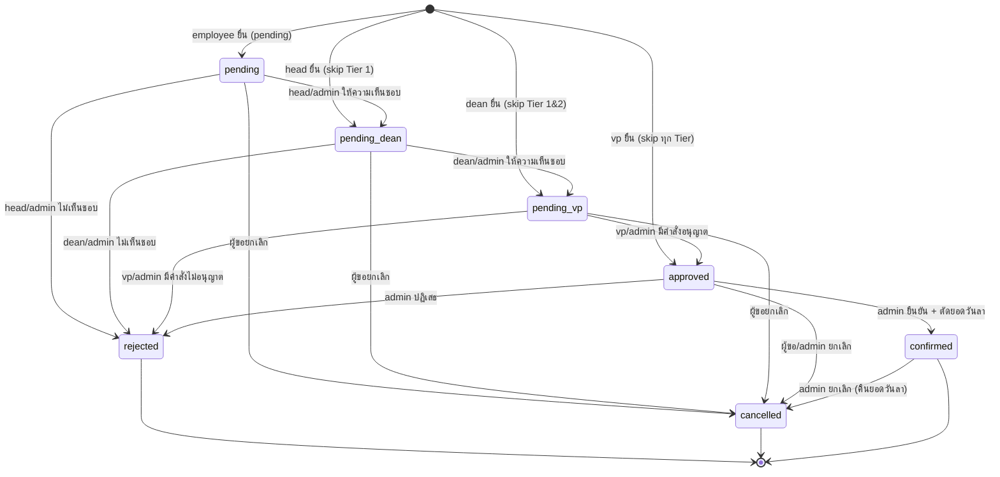

# ระบบบริหารการลา มหาวิทยาลัยราชภัฏบุรีรัมย์
## Buriram Rajabhat University Leave Management System (BRU LMS)

---

## 1. ข้อมูลภาพรวมผลิตภัณฑ์ (Product Overview)

ระบบบริหารการลา มหาวิทยาลัยราชภัฏบุรีรัมย์ (BRU Leave Management System) เป็นเว็บแอปพลิเคชันระดับองค์กรที่พัฒนาขึ้นเพื่อยกระดับและเปลี่ยนผ่านกระบวนการบริหารจัดการการลาของบุคลากรภายในมหาวิทยาลัยจากระบบเอกสารกระดาษสู่ระบบดิจิทัลแบบครบวงจร (End-to-End Digital Transformation) สอดคล้องตามระเบียบสำนักนายกรัฐมนตรีว่าด้วยการลาของข้าราชการ พ.ศ. 2555 และข้อบังคับมหาวิทยาลัยราชภัฏบุรีรัมย์

ระบบครอบคลุมตั้งแต่การยื่นใบลาออนไลน์ การแนบเอกสารหลักฐาน การลงลายมือชื่อดิจิทัล (Digital Signature) เวิร์กโฟลว์การพิจารณาอนุมัติตามสายการบังคับบัญชา 3 ระดับ (หัวหน้างาน → คณบดี/ผอ.สำนัก → รองอธิการบดีฯ) การตรวจสอบสิทธิและยอดวันลาคงเหลือ การเชื่อมโยงปฏิทินวันลาของทีม ไปจนถึงการออกรายงานสถิติ การส่งออกไฟล์ Excel/PDF สำหรับงานบริหารงานบุคคล และการประมวลผลยอดวันลาประจำปีงบประมาณอัตโนมัติ

---

## 2. กลุ่มผู้ใช้งานและบทบาท (User Roles & Personas)

ระบบแบ่งบทบาทผู้ใช้งานออกเป็น **5 ระดับ** ตามสายการบังคับบัญชาจริงในมหาวิทยาลัยราชภัฏบุรีรัมย์:

### 2.1 บุคลากรทั่วไป (Personnel / Employee) — Role: `employee`
- **เป้าหมาย:** ยื่นคำขอลาได้อย่างสะดวกรวดเร็ว ตรวจสอบสิทธิและประวัติการลาของตนเองได้แบบเรียลไทม์
- **ฟังก์ชันหลัก:**
  - ยื่นคำขอลาออนไลน์ (เลือกประเภทการลา, ช่วงเวลาเต็มวัน/ครึ่งวันเช้า/บ่าย, ระบุเหตุผล, สถานที่ติดต่อ, แนบเอกสาร)
  - พรีวิวและสร้างแบบฟอร์มใบลามาตรฐานราชการในรูปแบบไฟล์ PDF พร้อมลายเซ็นดิจิทัล (ฝั่ง Client ด้วย `pdf-lib`)
  - ตรวจสอบยอดวันลาคงเหลือ (Leave Balance) และประวัติการลา (Leave History)
  - ยกเลิกคำขอลาที่อยู่ระหว่างรอการพิจารณา
  - ดูปฏิทินวันลาส่วนตัว และปฏิทินวันลาของเพื่อนร่วมทีม/สาขาวิชา (Team Calendar)
  - ดาวน์โหลดแบบฟอร์มใบลาทางการ และศึกษาระเบียบข้อบังคับการลา
  - จัดการข้อมูลส่วนตัว อัปโหลดรูปโปรไฟล์ และอัปโหลด/วาดลายเซ็นดิจิทัล
- **สถานะใบลาเริ่มต้นเมื่อยื่น:** `pending`

### 2.2 หัวหน้างาน / หัวหน้าภาค / หัวหน้าสาขาวิชา (Department Head) — Role: `head`
- **เป้าหมาย:** พิจารณา กลั่นกรอง และให้ความเห็นชอบคำขอลาของผู้ใต้บังคับบัญชาในสังกัดเดียวกัน (**Tier 1 Approver**)
- **ฟังก์ชันหลัก:**
  - เข้าถึงหน้า "อนุมัติการลา" (`/approvals`) เพื่อดูรายการใบลา `pending` ของผู้ใต้บังคับบัญชาในแผนก/สาขาวิชาเดียวกัน
  - ตรวจสอบรายละเอียดคำขอลา ประวัติการลา ยอดคงเหลือ และพรีวิวเอกสาร PDF
  - ดำเนินการ "ให้ความเห็นชอบ" พร้อมบันทึกความเห็น (`headComment`) และประทับลายเซ็นดิจิทัล → สถานะเปลี่ยนเป็น `pending_dean`
  - ดำเนินการ "ไม่เห็นชอบ (Reject)" พร้อมระบุเหตุผล (`rejectionReason`) → สถานะเปลี่ยนเป็น `rejected`
  - ดูปฏิทินวันลาส่วนตัวและของทีม
  - **ยื่นคำขอลาของตนเอง**: สถานะเริ่มต้นข้าม Tier 1 เป็น `pending_dean` อัตโนมัติ

### 2.3 คณบดี / ผู้อำนวยการสำนัก / ผู้อำนวยการสถาบัน (Dean/Director) — Role: `dean`
- **เป้าหมาย:** ให้ความเห็นชอบคำขอลาที่ผ่าน Tier 1 มาแล้ว (**Tier 2 Approver**)
- **ฟังก์ชันหลัก:**
  - เข้าถึงหน้า "อนุมัติการลา" (`/approvals`) เพื่อดูรายการใบลา `pending_dean` ของบุคลากรในคณะ/สำนักในสังกัด
  - ดำเนินการ "ให้ความเห็นชอบ" พร้อมบันทึกความเห็น (`deanComment`) และประทับลายเซ็นดิจิทัล → สถานะเปลี่ยนเป็น `pending_vp`
  - ดำเนินการ "ไม่เห็นชอบ (Reject)" → สถานะเปลี่ยนเป็น `rejected`
  - **ยื่นคำขอลาของตนเอง**: สถานะเริ่มต้นข้าม Tier 1 & 2 เป็น `pending_vp` อัตโนมัติ

### 2.4 รองอธิการบดีฝ่ายบริหารงานบุคคลและเทคโนโลยีสารสนเทศ (Vice President) — Role: `vp`
- **เป้าหมาย:** มีคำสั่งอนุญาต/ไม่อนุญาตสำหรับคำขอลาที่ผ่าน Tier 1 & 2 มาแล้ว (**Tier 3 Final Authority**)
- **ฟังก์ชันหลัก:**
  - เข้าถึงหน้า "อนุมัติการลา" (`/approvals`) เพื่อดูรายการใบลา `pending_vp`
  - มีคำสั่ง "อนุญาต (`allow`)" → สถานะเปลี่ยนเป็น `approved` พร้อมบันทึก `vpDecision: "allow"`, `vpComment`
  - มีคำสั่ง "ไม่อนุญาต (`disallow`)" → สถานะเปลี่ยนเป็น `rejected` พร้อมบันทึก `vpDecision: "disallow"`
  - **ยื่นคำขอลาของตนเอง**: สถานะเริ่มต้นเป็น `approved` ทันที (ข้ามทุก Tier)

### 2.5 ผู้ดูแลระบบ / เจ้าหน้าที่กองบริหารงานบุคคล (HR Administrator) — Role: `admin`
- **เป้าหมาย:** บริหารจัดการระบบ กำหนดค่าองค์กร กำกับดูแลคำขอลาทั้งหมด ออกรายงาน และดูแลความถูกต้องของข้อมูล
- **ฟังก์ชันหลัก:**
  - สามารถดำเนินการ **อนุมัติ/ปฏิเสธทุก Tier** ในนามของผู้ดูแลระบบ (Bypass isolation rules)
  - จัดการใบลาทั้งหมดในระบบ (`/admin/leaves`) และ **ยืนยันการลา (Confirm)** ซึ่งหักยอดวันลาจาก `LeaveBalance` อย่างเป็นทางการ
  - จัดการข้อมูลบุคลากร (`/users`) เพิ่ม/แก้ไข/ลบ กำหนดสังกัดคณะ สาขาวิชา และหัวหน้างาน
  - นำเข้าข้อมูลบุคลากรแบบกลุ่ม (Batch Import) ผ่านไฟล์ CSV / Excel พร้อมพรีวิว
  - ซิงค์ข้อมูลกับฐานข้อมูลมหาวิทยาลัย (Remote SQL) หรือ University REST API
  - จัดการโครงสร้างองค์กร (คณะ/สำนัก/สถาบัน และ สาขาวิชา/ฝ่ายงาน)
  - จัดการประเภทการลา สิทธิวันลาพื้นฐาน และเงื่อนไขการสะสมวันลา (`/leave-types`)
  - จัดการปฏิทินวันหยุดนักขัตฤกษ์และวันหยุดราชการประจำปี (`/holidays`)
  - ดูสถิติการลา ออกรายงานสรุป และส่งออกข้อมูลเป็น Excel หรือ PDF (`/reports`)
  - ดำเนินการตัดยอดและยกยอดวันลาพักผ่อนประจำปีงบประมาณ (Fiscal Year Rollover — Cron Job)

---

## 3. สิทธิ์การเข้าถึงเมนูและระบบ (Access Control Matrix)

| เมนู / ฟังก์ชัน | เส้นทาง (Route) | `employee` | `head` | `dean` | `vp` | `admin` |
|---|---|:---:|:---:|:---:|:---:|:---:|
| หน้าหลัก (Dashboard) | `/dashboard` | ✅ | ✅ | ✅ | ✅ | ✅ |
| ยื่นใบลา (Leave Request) | `/leave-request` | ✅ | ✅ | ✅ | ✅ | ❌ |
| ประวัติการลา (Leave History) | `/leave-history` | ✅ | ✅ | ✅ | ✅ | ❌ |
| ปฏิทินการลาส่วนตัว (Calendar) | `/calendar` | ✅ | ✅ | ✅ | ✅ | ✅ |
| วันลาทีม (Team Calendar) | `/team-calendar` | ✅ | ✅ | ✅ | ✅ | ❌ |
| ดาวน์โหลดแบบฟอร์ม (Leave Forms) | `/forms` | ✅ | ✅ | ✅ | ✅ | ✅ |
| ระเบียบการลา (Leave Regulations) | `/regulations` | ✅ | ✅ | ✅ | ✅ | ✅ |
| ข้อมูลส่วนตัวและลายเซ็น (Profile) | `/profile` | ✅ | ✅ | ✅ | ✅ | ✅ |
| อนุมัติการลา (Approvals) | `/approvals` | ❌ | ✅ | ✅ | ✅ | ✅ |
| จัดการใบลาทั้งหมด (Admin Leaves) | `/admin/leaves` | ❌ | ❌ | ❌ | ❌ | ✅ |
| จัดการบุคลากร (User Management) | `/users` | ❌ | ❌ | ❌ | ❌ | ✅ |
| รายงานการลา (Reports & Analytics) | `/reports` | ❌ | ❌ | ❌ | ❌ | ✅ |
| จัดการประเภทการลา (Leave Types) | `/leave-types` | ❌ | ❌ | ❌ | ❌ | ✅ |
| จัดการวันหยุด (Holiday Management) | `/holidays` | ❌ | ❌ | ❌ | ❌ | ✅ |

---

## 4. ประเภทบุคลากรและสิทธิ์การลา (Personnel Categories)

ระบบรองรับบุคลากร 5 หมวดตามขอบเขตโครงการ 1.4.2 (ฟิลด์ `personnelType` ใน User model):

| รหัส | ประเภท | หมวด |
|---|---|---|
| `civil_servant_academic` | ข้าราชการในสถาบันอุดมศึกษา (สายผู้สอน) | ข้าราชการ |
| `civil_servant_support` | ข้าราชการในสถาบันอุดมศึกษา (สายสนับสนุน) | ข้าราชการ |
| `university_employee_academic` | พนักงานมหาวิทยาลัยสายผู้สอน *(Default)* | พนักงานมหาวิทยาลัย |
| `university_employee_support` | พนักงานมหาวิทยาลัยสายสนับสนุน | พนักงานมหาวิทยาลัย |
| `contract_lecturer` | อาจารย์อัตราจ้าง | อาจารย์อัตราจ้าง |
| `temporary_employee` | ลูกจ้างชั่วคราวมหาวิทยาลัย | ลูกจ้างชั่วคราว |

---

## 5. ประเภทการลาและกฎเกณฑ์ทางธุรกิจ (Leave Types & Business Logic)

ระบบรองรับประเภทการลามาตรฐานราชการไทย 8 ประเภท (จัดเก็บใน `leave_types` table, FK ด้วย `leaveTypeId`):

1. **ลาป่วย (Sick Leave - `sick`):** สำหรับการเจ็บป่วยหรือรักษาพยาบาล หากลาติดต่อกันตั้งแต่ 3 วันทำการขึ้นไป ระบบจะแจ้งเตือนให้แนบใบรับรองแพทย์ (`requiresMedicalCert: true`)
2. **ลากิจส่วนตัว (Personal Leave - `personal`):** สำหรับการทำธุระส่วนตัวที่จำเป็น ระบุเหตุผลและสถานที่ติดต่อ
3. **ลาพักผ่อน (Vacation Leave - `vacation`):** สำหรับการพักผ่อนประจำปี มีการคำนวณวันสะสมตามอายุราชการ และสามารถยกยอดสะสมข้ามปีงบประมาณได้ตามระเบียบ (`carriedOverDays`)
4. **ลาคลอดบุตร (Maternity Leave - `maternity`):** สิทธิการลาเพื่อคลอดบุตรสำหรับบุคลากรหญิง (สูงสุด 90 วัน)
5. **ลาช่วยภรรยาคลอด (Paternity Leave - `paternity`):** สิทธิสำหรับบุคลากรชายเพื่อช่วยดูแลภรรยาและบุตรแรกเกิด (สูงสุด 15 วันทำการ)
6. **ลาเลี้ยงดูบุตร (Childcare Leave - `childcare`):** การลาต่อเนื่องเพื่อดูแลบุตร
7. **ลาอุปสมบทหรือประกอบพิธีฮัจย์ (Ordination/Hajj Leave - `ordination`):** สำหรับบุคลากรที่ประสงค์จะอุปสมบทหรือเดินทางไปประกอบพิธีฮัจย์
8. **ลาตรวจเลือกหรือเตรียมพล (Military Leave - `military`):** สำหรับการเข้ารับการตรวจเลือกหรือระดมพลตามกฎหมายว่าด้วยการรับราชการทหาร

### กฎเกณฑ์การคำนวณวันลา (Calculation Rules)
- **รองรับหน่วยวันลาแบบครึ่งวัน:** รองรับการลาเต็มวัน (1.0 วัน), ครึ่งวันเช้า (0.5 วัน), และครึ่งวันบ่าย (0.5 วัน); เก็บใน `total_days DECIMAL(4,1)`
- **การนับวันทำการ (Working Days):** ระบบจะไม่นับวันเสาร์-อาทิตย์ และวันหยุดนักขัตฤกษ์ที่ระบุในตาราง `holidays` (สำหรับประเภทการลาที่นับเฉพาะวันทำการ)
- **รอบปีงบประมาณ (Fiscal Year):** ยึดรอบปีงบประมาณราชการไทย (1 ตุลาคม – 30 กันยายนของปีถัดไป) คำนวณด้วยฟังก์ชัน `getFiscalYear(date)`
- **การยกยอดวันลาพักผ่อน (Vacation Balance Carryover):** มีระบบ Cron Job (`fiscalYearJob.js`) ทำงานอัตโนมัติทุกวันที่ 1 ตุลาคม เวลา 00:01 น. เพื่อตัดรอบยอดวันลาประจำปี และคำนวณวันลาพักผ่อนสะสมตามเกณฑ์อายุราชการ (≥10 ปี: สูงสุด 20 วัน / <10 ปี: สูงสุด 10 วัน)

---

## 6. เวิร์กโฟลว์การขออนุมัติการลา (Approval Workflow)


```mermaid
stateDiagram-v2
    [*] --> pending: employee ยื่น (pending)
    [*] --> pending_dean: head ยื่น (skip Tier 1)
    [*] --> pending_vp: dean ยื่น (skip Tier 1&2)
    [*] --> approved: vp ยื่น (skip ทุก Tier)

    pending --> pending_dean: head/admin ให้ความเห็นชอบ
    pending --> rejected: head/admin ไม่เห็นชอบ
    pending --> cancelled: ผู้ขอยกเลิก

    pending_dean --> pending_vp: dean/admin ให้ความเห็นชอบ
    pending_dean --> rejected: dean/admin ไม่เห็นชอบ
    pending_dean --> cancelled: ผู้ขอยกเลิก

    pending_vp --> approved: vp/admin มีคำสั่งอนุญาต
    pending_vp --> rejected: vp/admin มีคำสั่งไม่อนุญาต
    pending_vp --> cancelled: ผู้ขอยกเลิก

    approved --> confirmed: admin ยืนยัน + ตัดยอดวันลา
    approved --> rejected: admin ปฏิเสธ
    approved --> cancelled: ผู้ขอ/admin ยกเลิก

    confirmed --> cancelled: admin ยกเลิก (คืนยอดวันลา)

    rejected --> [*]
    cancelled --> [*]
    confirmed --> [*]
```

**รายละเอียดแต่ละขั้นตอน:**

1. **Submission:** บุคลากรกรอกแบบฟอร์ม เลือกประเภทการลา วันที่ ช่วงเวลา ระบุเหตุผล แนบไฟล์ และเลือกลายเซ็นดิจิทัล ระบบบันทึกสถานะตามบทบาทผู้ยื่น และส่ง SSE/In-App Notification + n8n Webhook ไปยังผู้เกี่ยวข้อง
2. **Tier 1 — Head Review (pending):** หัวหน้าในสังกัดเดียวกัน (`departmentId` ตรงกัน) ตรวจสอบและให้ความเห็นชอบ → `pending_dean` หรือไม่เห็นชอบ → `rejected` พร้อมบันทึก `headComment`
3. **Tier 2 — Dean Review (pending_dean):** คณบดี/ผอ.สำนักในคณะเดียวกัน ตรวจสอบและให้ความเห็นชอบ → `pending_vp` หรือไม่เห็นชอบ → `rejected` พร้อมบันทึก `deanComment`
4. **Tier 3 — VP Order (pending_vp):** รองอธิการบดีฯ มีคำสั่งอนุญาต (`vpDecision: "allow"`) → `approved` หรือ ไม่อนุญาต (`vpDecision: "disallow"`) → `rejected`
5. **Admin Confirmation (approved → confirmed):** ผู้ดูแลระบบ/เจ้าหน้าที่ HR ยืนยันความถูกต้องและดำเนินการ "ยืนยันการลา" ซึ่งจะหักยอดวันลาใน `leave_balances` อย่างเป็นทางการ
6. **Cancellation & Balance Restoration:** ผู้ขอหรือ Admin สามารถยกเลิกได้จากทุกสถานะ ยกเว้น `rejected`; หากยกเลิกจากสถานะ `confirmed` ระบบจะ **คืนยอดวันลาโดยอัตโนมัติ** (`usedDays - totalDays`)
7. **Audit Trail:** ทุกการเปลี่ยนแปลงสถานะบันทึกลง `leave_histories` (`action`, `actionBy`, `oldStatus`, `newStatus`, `note`) ภายใน Transaction เดียวกัน

---

## 7. โมดูลระบบที่สำคัญ (Key Functional Modules)

### 7.1 ระบบการจัดการผู้ใช้และองค์กร (User & Organization Management)
- โครงสร้างองค์กร 2 ระดับ: คณะ/สำนัก/สถาบัน (`faculties`) → สาขาวิชา/กอง/ฝ่าย (`departments`)
- ความสัมพันธ์แบบลำดับขั้น: ผู้ใต้บังคับบัญชาเชื่อมโยงกับหัวหน้างาน (`supervisorId` Self-referential FK)
- การนำเข้าผู้ใช้แบบกลุ่ม (CSV/Excel Import) พร้อมระบบตรวจสอบความถูกต้องของฟิลด์และตัวอย่างก่อนนำเข้า (Preview & Validation)
- ระบบซิงค์ข้อมูลกับฐานข้อมูลภายนอก (Remote MySQL/MariaDB) และ University REST API พร้อมการป้องกัน SSRF และ SQL Injection

### 7.2 ระบบสร้างและดาวน์โหลดเอกสารราชการ (Document & PDF Generation)
- **Client-Side PDF Generation:** สร้างใบลาตามระเบียบราชการไทยบนฝั่ง Client ด้วย `pdf-lib` + `@pdf-lib/fontkit`, overlay ข้อมูลลงบนเทมเพลต PDF ทางการ, ฝังลายเซ็นดิจิทัลทั้งผู้ขอลาและหัวหน้างาน, แสดง/ดาวน์โหลดได้โดยไม่ต้องส่งข้อมูลไป Server
- **Server-Side Report Generation:** สร้างรายงานสถิติการลาในรูปแบบ Excel (.xlsx) ด้วย ExcelJS และ PDF ตามมาตรฐาน ก.พ. ด้วย PDFKit บน Server
- รองรับการดาวน์โหลดแบบฟอร์มเอกสารใบลาฉบับเปล่าทางการผ่าน `/forms`

### 7.3 ระบบแจ้งเตือนแบบเรียลไทม์ (In-App Notification Center & SSE)
- **Server-Sent Events (SSE):** ส่งการแจ้งเตือน Real-time ผ่าน `GET /api/notifications/stream` โดยไม่ต้อง Polling
- แจ้งเตือน In-App (ไอคอนกระดิ่งพร้อม Badge จำนวนที่ยังไม่อ่าน) สำหรับทุกการเปลี่ยนแปลงสถานะใบลา
- Responsive Notification Drawer รองรับทั้ง Desktop (ป๊อปอัปขึ้นจากแถบด้านล่างของ Sidebar) และ Mobile (เมนูแบบเต็มความกว้าง)
- Heartbeat keep-alive ทุก 25 วินาทีเพื่อรักษา connection

### 7.4 ระบบคิวงานพื้นหลัง (Background Queue & Email Workers)
- **BullMQ + Redis:** คิวงานหลักสำหรับการส่งอีเมลแจ้งเตือนแบบ Asynchronous
- **In-Memory Fallback Queue:** ทำงานแทน BullMQ เมื่อ Redis ไม่พร้อม (สำหรับ dev environment หรือ deployment ที่ไม่มี Redis)
- **Email Workers:** ส่งอีเมลแจ้งเตือนผ่าน Nodemailer + Resend ตาม Queue Type (`LEAVE_CREATED`, `LEAVE_STATUS_CHANGE`)

### 7.5 ระบบอัตโนมัติ n8n Webhook Integration
- `POST /api/webhooks/n8n-callback` — รับ callback จาก n8n workflow หลังดำเนินการ
- `GET /api/webhooks/weekly-report` — endpoint สำหรับ n8n ดึงสถิติการลาประจำสัปดาห์เพื่อสร้างรายงาน
- n8n Webhooks ถูก trigger หลัง commit transaction ของ LeaveLifecycle service (fire-and-forget ไม่บล็อก response หลัก)

### 7.6 ระบบรายงานและการวิเคราะห์ (Reporting & Data Analytics)
- แดชบอร์ดสรุปสถิติภาพรวมการลาในรูปแบบการ์ดสถิติ (จำนวนรอดำเนินการ, อนุมัติแล้ว, ยืนยันแล้ว)
- รายงานการลาแบบละเอียด กรองตามปีงบประมาณ คณะ สาขาวิชา ประเภทการลา และสถานะ
- ส่งออกข้อมูลเป็นไฟล์ Excel (.xlsx) และ PDF (.pdf) ที่จัดรูปแบบตารางตามมาตรฐาน ก.พ./มรภ.บุรีรัมย์
- แผนภูมิวิเคราะห์สถิติด้วย Chart.js / react-chartjs-2

---

## 8. สถาปัตยกรรมทางเทคนิค (Technical Architecture)

```
[ Frontend: React 19 + Vite 7 ]
   │
   ├─ React Router v7 (Code Splitting / Lazy Loading)
   ├─ AuthContext (JWT Cookie-based Auth + Role detection)
   ├─ ToastContext (In-app toast notification system)
   ├─ TanStack Query v5 (Data fetching, caching, cache invalidation)
   ├─ Axios Instance (Interceptors, Auto-bearer, Error handling)
   ├─ Vanilla CSS Design System (Custom Tokens, Responsive Grid)
   ├─ PDF Generation Engine (pdf-lib + fontkit: Client-side Thai form overlay)
   ├─ Chart.js + react-chartjs-2 (Statistics visualization)
   ├─ SSE Real-time Listener (useRealtimeNotifications hook)
   └─ Vercel Analytics (@vercel/analytics)
         │
    HTTPS / JSON / Multipart / SSE
         │
[ Backend: Node.js + Express 4 ]
   │
   ├─ Security Middleware (Helmet, Rate Limiter, CORS, Cookie Parser, Compression)
   ├─ File Validation Middleware (Multer, Magic Bytes / File Signature Verification)
   ├─ Authentication & RBAC (JWT, Bcryptjs, Express-Validator)
   ├─ Business Logic Services
   │   ├─ leaveLifecycleService.js  — Multi-tier approval state machine
   │   ├─ leaveValidationService.js — Business rule validation + working day calc
   │   ├─ leaveBalanceService.js    — Balance query helpers
   │   ├─ userIngestionService.js   — CSV/DB/API batch import
   │   ├─ reportExportService.js    — Excel + PDF report generation
   │   ├─ sseService.js             — Real-time SSE connection registry
   │   ├─ emailService.js           — Nodemailer/Resend email templates
   │   └─ n8nService.js             — n8n Webhook trigger service
   ├─ Background Queues (BullMQ / In-Memory Worker + emailWorker)
   ├─ Scheduled Cron Jobs (fiscalYearJob — 1 ต.ค. อัตโนมัติ)
   └─ ORM Layer (Sequelize v6)
         │
[ Database & Storage ]
   ├─ MySQL 8.0 / MariaDB (Relational DB, FK, Indexes, Transactions with FOR UPDATE)
   ├─ Cloudinary / Local Disk Storage (Profiles, Signatures, Attachments)
   └─ Redis (Optional — BullMQ queue backend, In-Memory fallback when unavailable)
```

---

## 9. ความปลอดภัยและการปฏิบัติตามมาตรฐาน (Security & Compliance)

1. **การยืนยันตัวตนและการเข้าถึง (Authentication & RBAC):**
   - การพิสูจน์ตัวตนด้วย JWT Token ร่วมกับ HTTP-only Cookie
   - รองรับ Token ผ่าน Authorization Bearer Header และ `?token=` Query String (สำหรับ SSE `EventSource`)
   - การเข้ารหัสผ่านด้วย `bcryptjs` (Cost factor = 10)
   - ระบบกู้คืนรหัสผ่านด้วย Time-limited Reset Token (หมดอายุภายใน 1 ชั่วโมง)
   - `protect` middleware โหลด User จาก DB ทุก request (ตรวจสอบ `isActive`)

2. **ความปลอดภัยของระบบ API (API Protection):**
   - ป้องกันการโจมตีแบบ Brute Force ด้วย `express-rate-limit` (Production: 200 req/15min ทั่วไป, 15 req/15min สำหรับ `/api/auth`)
   - ตั้งค่า HTTP Security Headers ด้วย `helmet`
   - ป้องกัน Cross-Origin Resource Sharing ด้วย dynamic CORS whitelist (ตรวจสอบทั้ง `allowedOrigins`, `FRONTEND_URL`, `CLIENT_URL` และ `.vercel.app`)
   - Graceful shutdown handler ปิด HTTP server → BullMQ queues อย่างสมบูรณ์ก่อน process exit

3. **การตรวจสอบไฟล์อัปโหลด (File Upload Hardening):**
   - ตรวจสอบทั้งนามสกุลไฟล์, MIME type และ **Magic Bytes** (File Signature) ของไฟล์รูปภาพและ PDF (`validateFileSignature.js`) เพื่อป้องกัน Malicious Executables
   - จำกัดขนาดไฟล์อย่างเคร่งครัด (รูปภาพ ≤ 5MB, ไฟล์นำเข้า ≤ 10MB)
   - รองรับสูงสุด 5 ไฟล์แนบต่อคำขอลา

4. **ความปลอดภัย User Ingestion:**
   - **SSRF Protection** (`isSSRFSafeUrl`): กรอง Private IP, Loopback, Link-local addresses และ DNS Rebinding
   - **SQL Injection Guard** (`isReadOnlySelectQuery`): อนุญาตเฉพาะ `SELECT` statement เท่านั้น; บล็อก `INSERT`, `UPDATE`, `DELETE`, `DROP`, `ALTER`, `EXEC`, `LOAD DATA`, `INTO OUTFILE`

5. **ความถูกต้องและการเข้าถึงข้อมูล (Data Integrity & Accessibility):**
   - ปกป้องฐานข้อมูลด้วย Sequelize Parameterized Queries ป้องกัน SQL Injection
   - Transaction-based state transitions พร้อม `SELECT ... FOR UPDATE` lock
   - รองรับมาตรฐานความสามารถในการเข้าถึง WCAG 2.1 AA (Contrast Ratio ≥ 4.5:1, Full Keyboard Navigation, Focus Outlines)
   - รองรับ `@media (prefers-reduced-motion: reduce)` เพื่อลดการเคลื่อนไหวสำหรับผู้ใช้ที่อ่อนไหวง่าย
